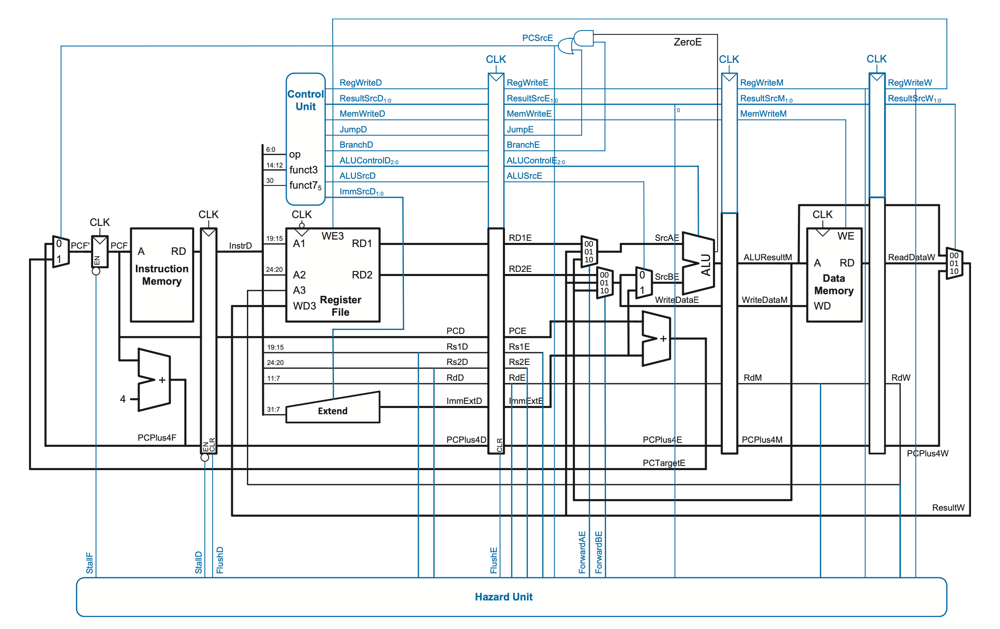
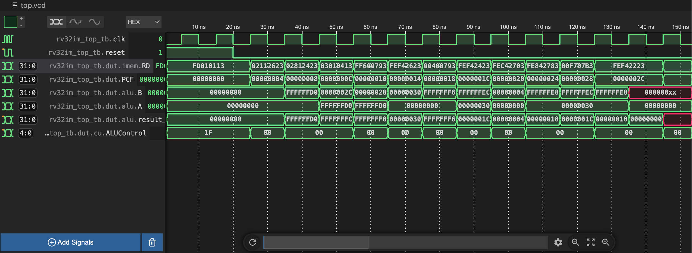
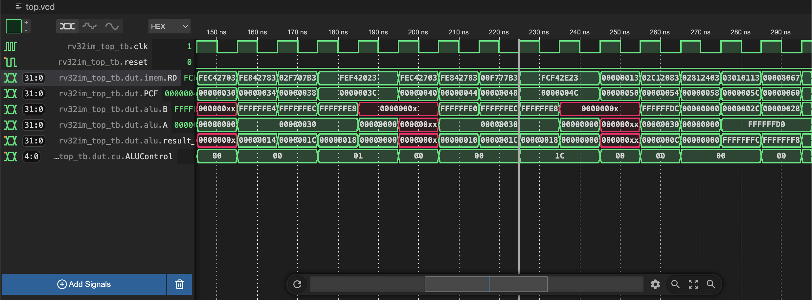
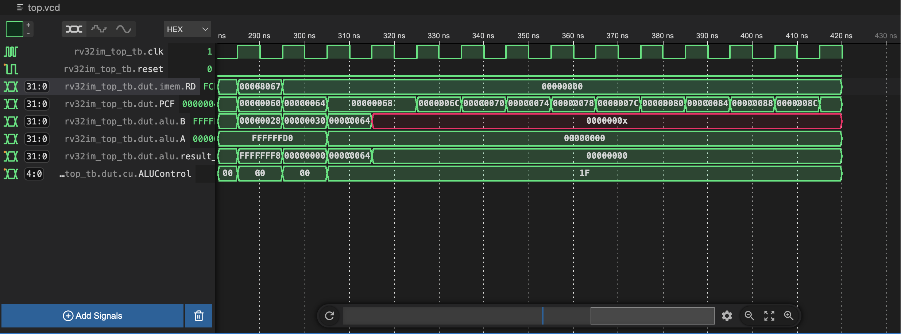

# RV32IM-RTL

The RV32IM processor is a pipelined design featuring a 5-stage pipeline (Fetch, Decode, Execute, Memory, Writeback) with support for basic integer operations, load/store instructions, and multiply/divide instructions from the M-extension. This implementation is intended for educational purposes, hardware prototyping, or as a starting point for more complex RISC-V-based systems.

## Block Diagram
of the RV32I. Ours is almost an exact match with some exceptions when it comes to control signals width. 




## Features

- **Instruction Set**: RV32I (base integer) + M-extension (multiply/divide)
- **Pipeline**: 5-stage with hazard detection and forwarding support


## Demo

### Example C Code

```c
void main() {
  volatile int x = -10;
  volatile int y = 4;
  int add = x + y;
  int mul = x * y;
  int and = x & y:
}
```

### Disassembly 
```text
   10094:	fd010113          	addi	sp,sp,-48
   10098:	02112623          	sw	ra,44(sp)
   1009c:	02812423          	sw	s0,40(sp)
   100a0:	03010413          	addi	s0,sp,48
   100a4:	ff600793          	li	a5,-10
   100a8:	fef42623          	sw	a5,-20(s0)
   100ac:	00400793          	li	a5,4
   100b0:	fef42423          	sw	a5,-24(s0)
   100b4:	fec42703          	lw	a4,-20(s0)
   100b8:	fe842783          	lw	a5,-24(s0)
   100bc:	00f707b3          	add	a5,a4,a5
   100c0:	fef42223          	sw	a5,-28(s0)
   100c4:	fec42703          	lw	a4,-20(s0)
   100c8:	fe842783          	lw	a5,-24(s0)
   100cc:	02f707b3          	mul	a5,a4,a5
   100d0:	fef42023          	sw	a5,-32(s0)
   100d4:	fec42703          	lw	a4,-20(s0)
   100d8:	fe842783          	lw	a5,-24(s0)
   100dc:	00f777b3          	and	a5,a4,a5
   100e0:	fcf42e23          	sw	a5,-36(s0)
   100e4:	00000013          	nop
   100e8:	02c12083          	lw	ra,44(sp)
   100ec:	02812403          	lw	s0,40(sp)
   100f0:	03010113          	addi	sp,sp,48
   100f4:	00008067          	ret
```

### Simulation of the Program Output

Below are 8 signals selected from the `top.vcd` file in the `/cpu` folder. The signals are, in order, Clock, Reset, Instruction Memory Output, Program Counter, ALU Operands, ALU Result, and the ALU select signal. 




